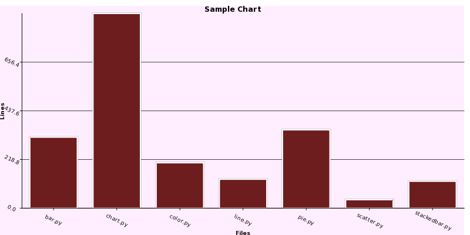
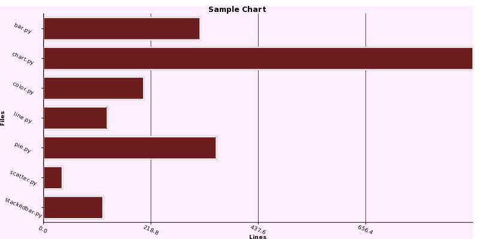
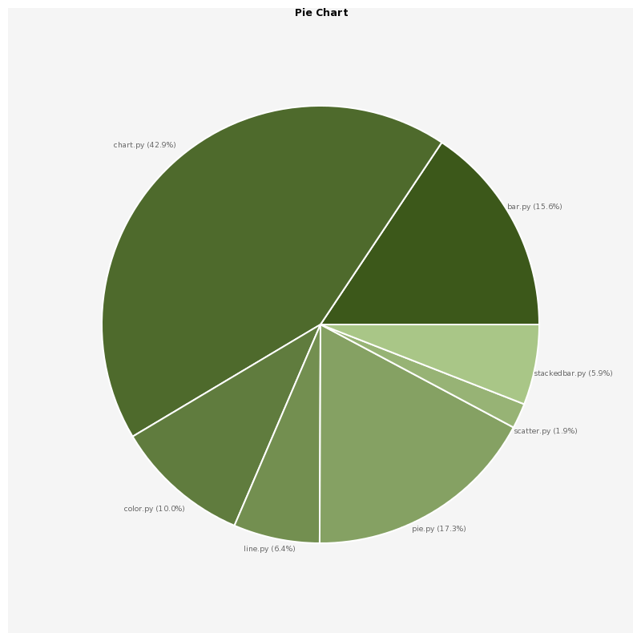
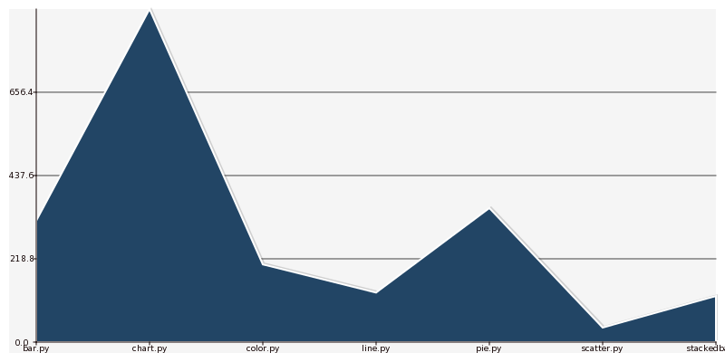

========
Examples
========

.. highlight:: python

There are several examples distributed with Pycha. You can find them in the
``examples`` directory. Let's analyze some of them.

Bar charts
----------

One of the most common used charts are bar charts. In the
``examples/barchart.py`` programm there are examples of vertical and
horizontal bar charts:

.. literalinclude:: ../../examples/barchart.py
   :linenos:

There are several things we can note in this source code listing:

* The ``barChart`` function will create a bar chart and save it to a png file
* The information shown in the chart is takes from the ``lines.py`` module,
  which, basically is a python module with a dataset composed of the
  number of lines that some Pycha modules have.
* Most of the code is about setting the options dictionary. We will see
  more about these options in the reference chapter but they should be
  pretty intuitive.

Let's see the output of running this programm.

   Vertical Bar Chart

   Example of vertical bar chart found in the Pycha examples directory

   Horizontal Bar Chart

   Example of horizontal bar chart found in the Pycha examples directory

Pie charts
----------

Pie charts are another very common type of charts. They are useful when
you only have one dataset and you want to compare each piece of information
with the rest.

Let's see the pie example in the ``examples/piechart.py`` file:

.. literalinclude:: ../../examples/piechart.py
   :linenos:

As you can see, this programm is very similar to the ``barchart.py`` one.
The only remarkable difference is that we are using the ``pycha.pie.PieChart``
class instead of the bar alternatives.

Let's see the output.

   Pie Chart

   Example of pie chart found in the Pycha examples directory

Line charts
-----------

The other big type of chart is line charts. As you may guest, in the
examples directory there is a programm that generates a lines chart, it is
called ``examples/linechart.py``:

.. literalinclude:: ../../examples/linechart.py
   :linenos:

No big surprises in this one neither since the structure is exactly the
same as in the other examples. Just the chart factory is different.

   Line Chart

   Example of line chart found in the Pycha examples directory

As you can see, by default the area between the line and the x axis is
filled. You can change this option if you just want to render the line.

Other examples
--------------

There are other chart examples in the ``examples`` directory of the pycha
source code. I suggest you to check them out to discover other types of
charts like:

* Error bar charts
* Scatter charts
* Stacked bar charts

There are also other examples where you can see special features and options:

* ``svg.py`` will output a SVG vectorial file instead of a PNG one.
* ``interval.py`` will use the interval option to setup the x axis
* ``color/colorschemes.py`` will try different color schemes.
